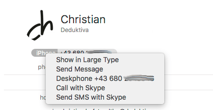

# Call me button for Address Book

## Configuration

Set parameters using `defaults`:

    defaults write com.apple.AddressBook AsteriskManagerHost -string asterisk.example.com
    defaults write com.apple.AddressBook AsteriskManagerPort -int 5038
    defaults write com.apple.AddressBook AsteriskManagerUsername -string yourusername
    defaults write com.apple.AddressBook AsteriskManagerPassword -string yourpassword
    defaults write com.apple.AddressBook AsteriskOriginateChannel -string "SIP/yourphone"
    defaults write com.apple.AddressBook AsteriskOriginateContext -string "from-internal"

## Installation

Build callme.bundle, then copy it to `~/Library/Address\ Book\ Plug-Ins`.
